# Initial Data Model

The schema is defined by `backend/migrations/001_initial_schema.sql`. This diagram shows the main ownership and activity relationships; tables not shown include permissions, question tags, scoring weight sets, feature flags, and audit details.

```mermaid
erDiagram
  USERS ||--o{ USER_ROLES : has
  ROLES ||--o{ USER_ROLES : grants
  ROLES ||--o{ ROLE_PERMISSIONS : allows
  PERMISSIONS ||--o{ ROLE_PERMISSIONS : describes
  INSTITUTIONS ||--o{ BATCHES : organizes
  USERS ||--o| CANDIDATE_PROFILES : owns
  BATCHES ||--o{ CANDIDATE_PROFILES : groups
  USERS ||--o{ RESUMES : uploads
  RESUMES ||--o{ RESUME_VERSIONS : versions
  RESUME_VERSIONS ||--o{ RESUME_ANALYSES : analyzes
  RESUME_ANALYSES ||--o{ RESUME_ISSUES : reports
  ROLE_CATALOG ||--o{ ROLE_SKILL_WEIGHTS : requires
  SKILLS ||--o{ ROLE_SKILL_WEIGHTS : weighted
  USERS ||--o{ ROLE_FIT_RESULTS : matches
  ROLE_CATALOG ||--o{ ROLE_FIT_RESULTS : ranks
  USERS ||--o{ SKILL_GAP_PLANS : improves
  SKILL_GAP_PLANS ||--o{ ROADMAP_TASKS : plans
  USERS ||--o{ QUESTIONS : authors
  USERS ||--o{ ASSESSMENTS : creates
  ASSESSMENTS ||--o{ ASSESSMENT_SECTIONS : contains
  ASSESSMENTS ||--o{ ASSESSMENT_ASSIGNMENTS : assigns
  USERS ||--o{ ASSESSMENT_ASSIGNMENTS : receives
  ASSESSMENTS ||--o{ ASSESSMENT_ATTEMPTS : attempted
  USERS ||--o{ ASSESSMENT_ATTEMPTS : takes
  ASSESSMENT_ATTEMPTS ||--o{ ATTEMPT_ANSWERS : saves
  ASSESSMENT_ATTEMPTS ||--o{ CODE_SUBMISSIONS : submits
  ASSESSMENT_ATTEMPTS ||--o{ PROCTOR_EVENTS : records
  USERS ||--o{ INTERVIEW_SESSIONS : practices
  INTERVIEW_SESSIONS ||--o{ INTERVIEW_QUESTIONS : asks
  INTERVIEW_QUESTIONS ||--o{ INTERVIEW_ANSWERS : answered
  INTERVIEW_SESSIONS ||--o{ INTERVIEW_EVALUATIONS : evaluates
  COMPANY_PROFILES ||--o{ JOBS : posts
  JOBS ||--o{ APPLICATIONS : receives
  USERS ||--o{ APPLICATIONS : applies
  APPLICATIONS ||--o{ SHORTLIST_DECISIONS : decides
  APPLICATIONS ||--o{ INTERVIEW_SCHEDULES : schedules
  USERS ||--o{ PLACEMENT_PROBABILITY_SNAPSHOTS : snapshots
  ROLE_CATALOG ||--o{ PLACEMENT_PROBABILITY_SNAPSHOTS : estimates
  USERS ||--o{ OUTCOME_RECORDS : tracks
  USERS ||--o{ CONSENT_RECORDS : consents
  USERS ||--o{ NOTIFICATIONS : receives
```

